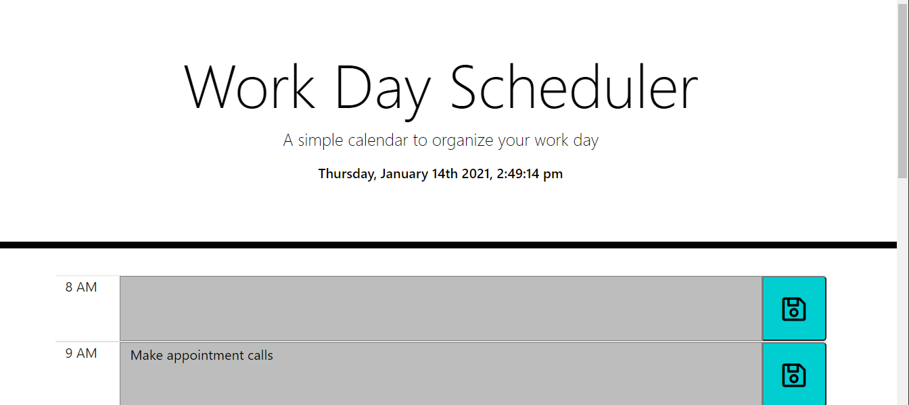
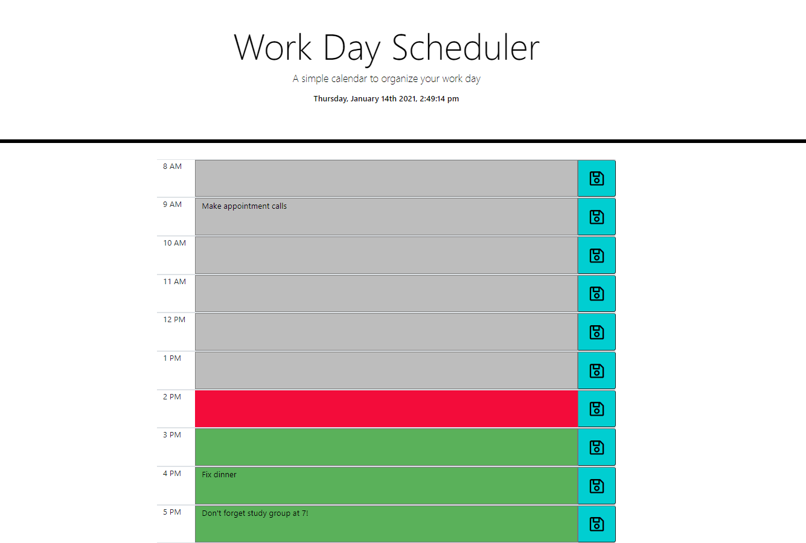

# Organize-Your-Day-Planner #

This is a simple calender application utilizing third-party API's.
This is a single day planner with time blocks for a standard, traditional business day, 8AM through 5PM. 

When the planner is opened the current date and time are at the top, 8AM is the first block.  A task, meeting or reminder can be entered in the block. If the save button at the right end of the text block is clicked the information entered will be saved in local storage. If the page is refreshed or reloaded before the save button is clicked the text will not be saved. 

 "Date and Time"

The text blocks are color coded based on the current time, the current hour is red, past hours are grey and future hours are green. Only the current day is accessible with this app. 

 "Full Day with color coding and saved entries"

The Moment.js library was used with this project as the source for date and time.

This page has a flexible layout and in the small (phone or tablet) the save button is under the text box for each hour. 

This link is to a video of the small screen version of the day planner:

<!-- blank line -->
<figure class="video_container">
  <iframe src="https://drive.google.com/file/d/1gmVBg-ZB4iipdCTMnRZcmFtBNI8e37h5/view" frameborder="0" allowfullscreen="true"> </iframe>
</figure>
<!-- blank line -->

